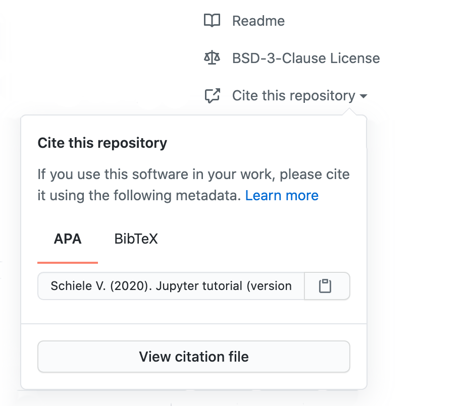

.. SPDX-FileCopyrightText: 2021 Veit Schiele
..
.. SPDX-License-Identifier: BSD-3-Clause

Citation File Format
====================

`Citation File Format <https://citation-file-format.github.io/>`_ ist ein Schema
für Software-Citation-Metadaten in maschinenlesbarem
:doc:`/data-processing/serialisation-formats/yaml/index`-Format. Dabei sollte
eine Datei ``CITATION.cff`` im Stammverzeichnis des Software-Repository
abgelegt werden. Der Inhalt der Datei kann :abbr:`z.B. (zum Beispiel)` so
aussehen:

.. code-block:: yaml

    cff-version: "1.1.0"
    message: "If you use this tutorial, please cite it as below."
    authors:
      -
        family-names: Schiele
        given-names: Veit
        orcid: "https://orcid.org/https://orcid.org/0000-0002-2448-8958"
    identifiers:
      -
        type: doi
        value: "10.5281/zenodo.4147287"
    keywords:
      - "data-science"
      - jupyter
      - "jupyter-notebooks"
      - "jupyter-kernels"
      - ipython
      - pandas
      - spack
      - pipenv
      - ipywidgets
      - "ipython-widget"
      - dvc
    title: "Jupyter tutorial"
    version: "0.8.0"
    date-released: 2020-10-08
    license: "BSD-3-Clause"
    repository-code: "https://github.com/veit/jupyter-tutorial"

Ihr könnt einfach das obige Beispiel anpassen um eure eigene
``CITATION.cff``-Datei zu erzeugen oder die Website `cffinit
<https://citation-file-format.github.io/cff-initializer-javascript/>`_
verwenden.

Mit `cff-validator <https://github.com/marketplace/actions/cff-validator>`_
steht euch eine GitHub-Action zur Verfügung, die ``CITATION.cff``-Dateien mit
dem R-Paket ``V8`` überprüft.

Es gibt auch einige Tools zum Workflow von :doc:`CITATION.cff <cff>`-Dateien:

* `cffconvert <https://github.com/citation-file-format/cffconvert>`_ konvertiert
  ``CITATION.cff``-Dateien in BibTeX, RIS, :doc:`codemeta`- und andere
  Dateiformate
* `doi2cff <https://github.com/citation-file-format/doi2cff>`_ erstellt eine
  ``CITATION.cff``-Datei aus einem Zenodo DOI

Auch GitHub bietet einen Service um die Informationen aus der
``CITATION.cff``-Datei eures GitHub-Repository im APA- und BibTex-Format zu
kopieren.

         ADA- und BibTex-Formate zu exportieren.

.. seealso::
   * `GitHub Docs: About CITATION files
     <https://docs.github.com/en/repositories/managing-your-repositorys-settings-and-features/customizing-your-repository/about-citation-files>`_

Wenn ihr einen DOI mit Zenodo registriert, wird die ``CITATION.cff``-Datei aus
dem GitHub-Repository ebenfalls verwendet. Auch `Zotero
<https://www.zotero.org/>`_ interpretiert die :doc:`cff`-Datei in
GitHub-Repositories; Zotero kann jedoch auch ohne :doc:`cff`-Datei
Metainformationen des Repository, wie Unternehmen, Programmiersprache
:abbr:`etc. (et cetera)`, übernehmen.
