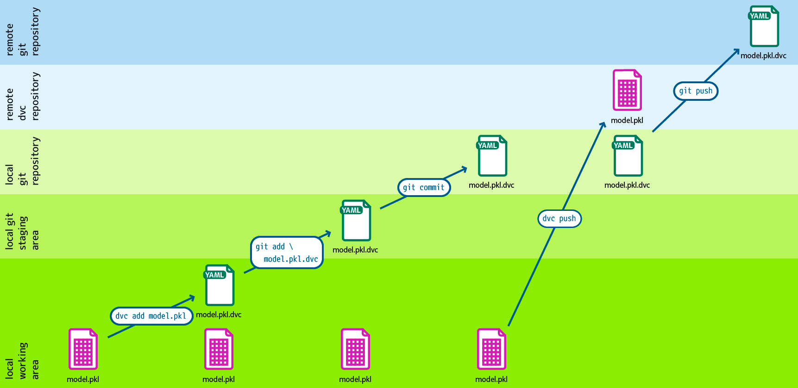

.. SPDX-FileCopyrightText: 2020 Veit Schiele
..
.. SPDX-License-Identifier: BSD-3-Clause

Pipelines
=========

Code und Daten verbinden
------------------------

Befehle wie ``dvc add``, ``dvc push`` und ``dvc pull`` können unabhängig von
Änderungen im Git-Repository vorgenommen werden und bieten daher nur die
Basis, um große Datenmengen und Modelle zu verwalten. Um tatsächlich
reproduzierbare Ergebnisse zu erzielen, müssen Code und Daten miteinander
verbunden werden.

   Design: André Henze, Berlin

Mit ``dvc stage`` könnt ihr einzelne Verarbeitungsstufen erstellen, wobei jede
Stufe durch eine, mit Git verwaltete, Quellcode-Datei sowie weiteren
Abhängigkeiten und Ausgabedaten beschrieben wird. Alle Stufen zusammen bilden
dann die DVC-Pipeline.

In unserem Beispiel `dvc-example <https://github.com/veit/dvc-example>`_ soll
die erste Stufe die Daten in Trainings- und Testdaten aufteilen:

.. code-block:: console

   $ uv run dvc stage add \
       -n prepare \
       -p prepare.seed,prepare.split \
       -d src/dvc_example/prepare.py -d data/data.xml \
       -o data/prepared \
       uv run python src/dvc_example/prepare.py data/data.xml

``-n``
    gibt den Namen der Verarbeitungsstufe an.
``-p``
    gibt die Parameter aus der :file:`params.yaml`-Datei an, die für diese Stufe
    verwendet werden sollen.

    .. seealso::
       :doc:`params`

``-d``
    gibt Abhängigkeiten (*dependencies*) für das reproduzierbare Kommando an.

    Wenn zum Reproduzieren der Ergebnisse beim nächsten Mal ``dvc repro``
    aufgerufen wird, überprüft DVC diese Abhängigkeiten und entscheidet, ob
    diese auf dem aktuellen Stand sind oder erneut ausgeführt werden müssen,
    um aktuellere Ergebnisse zu erhalten.

``-o``
    gibt die Ausgabedatei oder das Ausgabeverzeichnis an.

Die generierte :file:`dvc.yaml`-Datei sieht dann folgendermaßen aus:

.. code-block:: yaml

   stages:
     prepare:
       cmd: uv run python src/dvc_example/prepare.py data/data.xml
       deps:
       - data/data.xml
       - src/dvc_example/prepare.py
       params:
       - prepare.seed
       - prepare.split
       outs:
       - data/prepared

Ruft ihr nun ``uv run dvc repro`` auf, werden in :file:`data/prepared` die
Dateien :file:`test.tsv` und :file:`train.tsv` erstellt, sowie :file:`dvc.lock`
geschrieben. Die Verzeichnisstruktur sieht dann so aus:

.. code-block:: console
   :emphasize-lines: 10, 13-18, 23

   ├── .dvc
   ├── .dvcignore
   ├── .git
   ├── .gitignore
   ├── .pre-commit-config.yaml
   ├── .python-version
   ├── .venv
   ├── README.md
   ├── data
   │   ├── .gitignore
   │   ├── data.xml
   │   ├── data.xml.dvc
   │   └── prepared
   │       ├── test.tsv
   │       └── train.tsv
   ├── dvc.lock
   ├── dvc.yaml
   ├── params.yaml
   ├── pyproject.toml
   ├── src
   │   └── dvc_example
   │       ├── __init__.py
   │       └── prepare.py
   └── uv.lock

.. seealso::
   `dvc repro <https://dvc.org/doc/command-reference/repro>`_

Die neuen und geänderten Programm- und Konfigurationsdateien sollten nun in Git
verwaltet werden:

.. code-block:: console

   $ git add data/.gitignore dvc.lock dvc.yaml src/dvc_example/prepare.py
   $ git commit -m ':sparkles: Add prepare step'

.. hint::
   DVC weiß durch die Pipeline-Definition, dass die Dateien in
   :file:`data/prepared` in der ``prepare``-Stufe generiert wurden. Mit ``uv run
   dvc repro`` oder ``uv run dvc commit`` könntet ihr sie jederzeit wieder
   herstellen.
