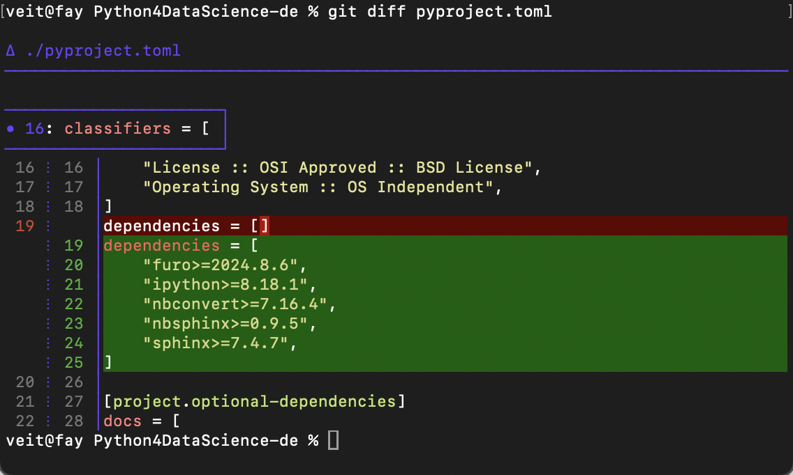
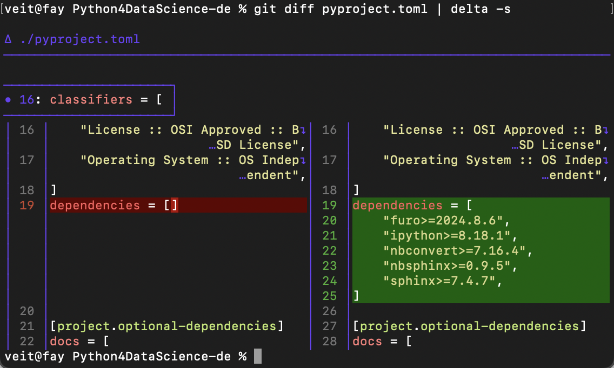

Shell-Konfiguration und Kommandozeilen-Werkzeuge
================================================

In diesem Kapitel möchte ich euch zwei mächtige Erweiterungen der Shell
vorstellen:

.. tab:: oh-my-zsh

   `oh-my-zsh <https://ohmyz.sh>`_ kann für die `Z Shell
   <https://zsh.sourceforge.io>`_ verwendet werden.

   .. seealso::
      * `Getting Started <https://github.com/ohmyzsh/ohmyzsh#getting-started>`_
      * `Plugins <https://github.com/ohmyzsh/ohmyzsh/wiki/Plugins>`_
      * `Git Plugin Aliases
        <https://github.com/ohmyzsh/ohmyzsh/blob/master/plugins/git/README.md#aliases>`_
      * `zsh-you-should-use
        <https://github.com/MichaelAquilina/zsh-you-should-use>`_

.. tab:: Starship

  `Starship <https://starship.rs>`_ ist ein schnelles Tool, das ihr mit jeder
  Shell verwenden könnt.

  * `git_branch-Modul <https://starship.rs/config/#git-branch>`_
  * `git_commit-Modul <https://starship.rs/config/#git-commit>`_
  * `git_state <https://starship.rs/config/#git-state>`_
  * `git_status-Modul <https://starship.rs/config/#git-status>`_

Pipes (``|``)
-------------

Git verwendet nie `less <https://www.greenwoodsoftware.com/less/>`_, wenn ihr
die Ausgabe in ein anderes Programm umleitet, wie :abbr:`z.B. (zum Beispiel)`:

.. code-block:: console

   $ git log --oneline | grep Jupyter

Ihr könnt jedoch die Ausgabe wieder an ``less`` übergeben:

.. code-block:: console

   $ git log --oneline | grep Jupyter | less

.. _git-delta:

delta
-----

`delta <https://dandavison.github.io/delta/>`_ ist eine schicke Diff-Anzeige,
siehe :abbr:`z.B. (zum Beispiel)`:

Installation
~~~~~~~~~~~~

.. tab:: Debian/Ubuntu

   Die :file:`.deb`-Dateien befinden sich auf der `Release
   <https://github.com/dandavison/delta/releases>`_-Seite.

.. tab:: macOS

   .. code-block:: console

      $ brew install git-delta

.. tab:: Windows

   .. code-block:: ps1

      > choco install delta

.. _delta_config:

Konfiguration
~~~~~~~~~~~~~

Eine Beispielkonfiguration findet ihr in `Git config file
<https://dandavison.github.io/delta/configuration.html#git-config-file>`_:

.. code-block:: ini

   [core]
       pager = delta

   [interactive]
       diffFilter = delta --color-only

   [delta]
       navigate = true  # use n and N to move between diff sections

   [merge]
       conflictstyle = zdiff3

delta erweitert jedoch nicht nur die Anzeige von ``git diff``, sondern auch die
von ``git add --patch``, ``git log --patch``, ``git blame``,  ``git
rebase``-Merge-Konflikten und ``git show``. Zudem kann delta auch Side-by-Side-Diffs anzuzeigen , :abbr:`z.B. (zum Beispiel)`:

Ihr könnt dies auch global konfigurieren mit:

.. code-block:: console

   $ git config --global delta.side-by-side true

ripgrep
-------

Installation
~~~~~~~~~~~~

.. tab:: Debian/Ubuntu

   Ihr könnt ripgrep mit einer binären :file:`.deb`-Datei installieren, die in
   jedem `ripgrep-Release <https://github.com/BurntSushi/ripgrep/releases>`_
   enthalten ist.

   .. code-block:: console

      $ curl -LO https://github.com/BurntSushi/ripgrep/releases/download/14.1.0/ripgrep_14.1.0-1_amd64.deb
      $ sudo dpkg -i ripgrep_14.1.0-1_amd64.deb

.. tab:: macOS

   .. code-block:: console

      $ brew install ripgrep

.. tab:: Windows

   .. code-block:: ps1

      > choco install ripgrep

.. seealso::
   * `rpgrep Installation
     <https://github.com/BurntSushi/ripgrep/blob/master/README.md#installation>`_

Beispiele
~~~~~~~~~

.. note::
   Das Paket heißt zwar ``ripgrep``, der Befehl ist jedoch ``rg``.

:samp:`$ rg {PATTERN}`
    sucht nach Regexen, wobei ihr oft Anführungszeichen verwenden solltet, um zu
    verhindern, dass die Shell Sonderzeichen interpretiert.
:samp:`$ rg {PATTERN} {FILENAMES}`
    beschränkt die Suche auf bestimmte Dateien, indem ihr sie nach dem Mustern
    benennt.
:samp:`$ rg -g|--glob {PATTERN}`
    filtert Dateien nach :abbr:`sog. (sogenannten)`
    `Globbing <https://de.wikipedia.org/wiki/Wildcard_(Informatik)>`_-Mustern.
:samp:`$ rg -t {SUFFIX} {PATTERN}`
    sucht nach Dateien mit bestimmten Dateiendungen.

    Mit ``rg --type-list`` erhaltet ihr alle möglichen Dateiendungen.

:samp:`$ rg -i|--ignore-case {PATTERN}`
    ignoriert die Groß- und Kleinschreibung.
:samp:`$ rg --hyperlink-format {EDITOR} {PATTERN}`
    erstellt Dateipfade als Terminal-Hyperlinks, die bei gedrückter
    :kbd:`Strg`- oder :kbd:`⌘`-Taste geöffnet werden können. Mögliche Editoren
    erhaltet ihr mit ``man rg``.
:samp:`$ rg --no-ignore {PATTERN}`, :samp:`$ rg -.|--hidden {-.PATTERN}`, :samp:`$ rg --binary {PATTERN}` oder :samp:`$ rg -u |--unrestricted {PATTERN}`
    zeigt auch Ergebnisse in Dateien an, die durch ``.gitignore``-Anweisungen,
    durch ``.`` versteckte Dateien oder binäre Dateien üblicherweise
    ausgefiltert werden.

    .. tipp::
       :samp:`$ rg -.|--hidden {-.PATTERN}` zeigt euch auch Ergebnisse im
       :file:`.git`-Verzeichnis an. Um dieses Verzeichnis von der Suche
       auszunehmen, könnt ihr dieses Verzeichnis Mit der Option
       :samp:`-g|--glob` und einem ``!`` ausschließen, also :samp:`rg -. -g
       '!.git' {PATTERN}`.

Konfiguration
~~~~~~~~~~~~~

Ihr könnt eine Konfigurationsdatei für ripgrep anlegen in
:file:`~/.config/ripgreprc`, :abbr:`z.B. (zum Beispiel)`:

.. code-block:: console

    --hyperlink-format
    default
    --smart-case
    --hidden
    --glob
    !.git

Anschließend könnt ihr die ``RIPGREP_CONFIG_PATH``-Umgebungsvariable definieren
mit

.. code-block:: console

   $ export RIPGREP_CONFIG_PATH=~/.config/ripgreprc
