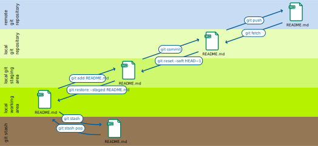

.. SPDX-FileCopyrightText: 2020 Veit Schiele
..
.. SPDX-License-Identifier: BSD-3-Clause

Arbeitsbereiche
===============

Git verwaltet mehrere Speicherorte oder **Workspaces**, in denen Dateien
gespeichert werden:

local working copy
    enthält Dateien und Verzeichnisse, die normal bearbeitet werden.
staging area
    enthält Änderungen an Dateien, die in die Versionsgeschichte geschrieben
    werden sollen.
local repository
    enthält die gesamte Historie aller Dateien im Projekt.
remote repository
    enthält ebenfalls die gesamte Historie, ist aber auf einem entfernten Server
    gespeichert.
stash
    enthält Änderungen, die vorübergehend an einem anderen Ort gespeichert
    werden, um sie aus dem aus dem Weg zu schaffen.

Grundlegende Git-Befehle
------------------------

Mit den folgenden grundlegenden Git-Befehlen werden Änderungen zwischen diesen
Arbeitsbereichen verschoben.

.. hint::
   Shell-Befehle verwenden eine Bash-kompatible Syntax. Daher sollten sie mit
   den gängigsten Shells, die für Git verwendet werden, kompatibel sein:

   * Windows: Git Bash
   * WSL: Bash
   * Linux: Bash oder Zsh
   * macOS: Zsh

   Möglicherweise müsst ihr die Syntax geringfügig anpassen, wenn ihr eine
   andere Shell verwendet, :abbr:`z.B. (zum Beispiel)` die PowerShell.

.. hint::
   Dieses Buch konzentriert sich auf die Kommandozeile und behandelt :abbr:`GUI
   (Grafische Benutzeroberflächen)`’s nur am Rande. Die Befehlszeile ist die
   leistungsfähigste Art, Git zu verwenden. GUIs implementieren nur eine
   Teilmenge dessen, was mit Git und der Shell möglich ist. Dennoch ist mit
   vielen GUIs ein hybrider Ansatz möglich und weit verbreitet: Ihr könnt eine
   grafische Benutzeroberfläche für Aufgaben verwenden, und die CLI für die
   volle Leistungsfähigkeit. In `GUI Clients
   <https://git-scm.com/downloads/guis>`_ könnt ihr euch ein passendes GUI-Tool
   auswählen.

``git add``
    fügt Dateien aus dem Arbeitsverzeichnis dem Bühnenbereich (:abbr:`engl.
    (englisch)`: *staging area*) hinzu.
``git reset HEAD``
    stellt eine Datei im Arbeitsbereich aus dem Bühnenbereich wieder her.
``git stash``
    verschiebt Dateien aus dem Arbeitsbereich in ein Versteck (:abbr:`engl.
    (englisch)`: *stash*).

    .. seealso::
       * :ref:`Mit Git arbeiten <git-stash>`

``git commit``
    schreibt Änderungen im Bühnenbereich in das lokale Repository.
``git pull``
    kopiert Änderungen aus dem entfernten in das lokale Repository und aktualisiert das Arbeitsverzeichnis.
``git push``
    kopiert Änderungen aus dem lokalen Repository in das entfernte (:abbr:`engl.
    (englisch)`: *remote*) Repository.

    :samp:`git push -u {UPSTREAM} {BRANCHNAME}`
        ``-u`` (Langform ``--set-upstream``)
            erlaubt die Angabe eines entfernten Repository und des darin
            enthaltenen Zweiges.

        :samp:`{UPSTREAM}`
            ist der Name des entfernten Repository, üblicherweise ``origin``.

        :samp:`{BRANCHNAME}`
            ist der Name des Zweiges im entfernten Repository, üblicherweise
            derselbe Name wie im lokalen Repository.
