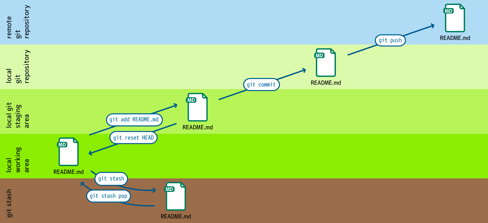

.. SPDX-FileCopyrightText: 2020 Veit Schiele
..
.. SPDX-License-Identifier: BSD-3-Clause

Arbeitsbereiche
===============

``git add``
    fügt Dateien aus dem Arbeitsverzeichnis dem Bühnenbereich (engl.: *staging
    area*) hinzu.
``git reset HEAD``
    stellt eine Datei im Arbeitsbereich aus dem Bühnenbereich wieder her.
``git stash``
    verschiebt Dateien aus dem Arbeitsbereich in ein Versteck (engl.: *stash*).
``git stash pop``
    holt Dateien aus dem Versteck in den Arbeitsbereich.
``git commit``
    schreibt Änderungen im Bühnenbereich in das lokale Repository.
``git pull``
    kopiert Änderungen aus dem entfernten in das lokale Repository.
``git push``
    kopiert Änderungen aus dem lokalen Repository in das entfernte (:abbr:`engl.
    (englisch)` remote) Repository.

    :samp:`git push -u {UPSTREAM} {BRANCHNAME}`
        ``-u`` (Langform ``--set-upstream``)
            erlaubt die Angabe eines entfernten Repository und des darin
            enthaltenen Zweiges.

        :samp:`{UPSTREAM}`
            ist der Name des entfernten Repository, üblicherweise ``origin``.

        :samp:`{BRANCHNAME}`
            ist der Name des Zweiges im entfernten Repository, üblicherweise
            derselbe Name wie im lokalen Repository.
