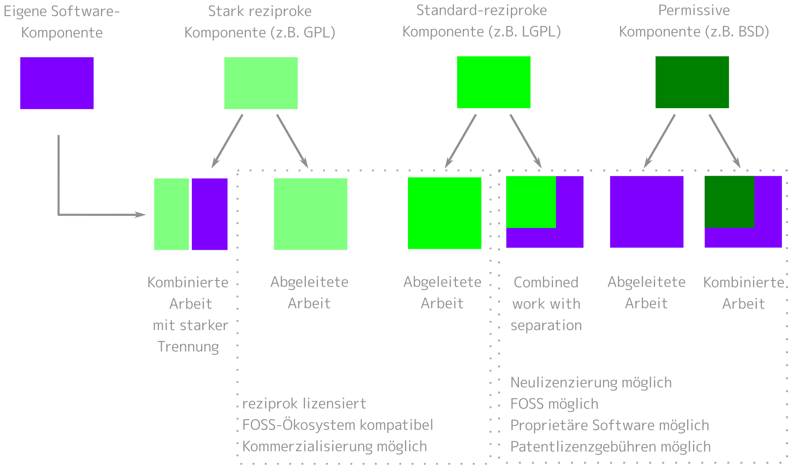

.. SPDX-FileCopyrightText: 2020 Veit Schiele
..
.. SPDX-License-Identifier: BSD-3-Clause

Lizenzieren
===========

Damit andere eure Software verwenden können, sollte sie eine oder mehrere
Lizenzen erhalten, die die Nutzungsbedingungen beschreiben. Andernfalls dürfte
sie meist urheberrechtlich geschützt sein. Urheber sind diejenigen, die zur
Software originär beigetragen haben. Wenn eine Software relizenziert werden
soll, ist häufig die Zustimmung aller Personen erforderlich, die Urheberschaft
beanspruchen können.

.. note::
   Dies stellt keine Rechtsberatung dar. Wendet euch im Zweifelsfall an eine
   Rechtsvertretung oder die Rechtsabteilung eures Unternehmens.

.. seealso::
   * `The Whys and Hows of Licensing Scientific Code
     <https://www.astrobetter.com/blog/2014/03/10/the-whys-and-hows-of-licensing-scientific-code/>`_
   * `A Quick Guide to Software Licensing for the Scientist-Programmer
     <https://journals.plos.org/ploscompbiol/article?id=10.1371/journal.pcbi.1002598>`_
   * Karl Fogel: `Producing Open Source Software <https://producingoss.com/>`_
   * `Forschungsdaten veröffentlichen
     <https://forschungsdaten.info/themen/rechte-und-pflichten/forschungsdaten-veroeffentlichen/>`_

Proprietäre Softwarelizenzen
----------------------------

Proprietäre Softwarelizenzen sind selten standardisiert; sie können kommerziell,
Shareware oder Freeware sein.

Freie und Open-Source Softwarelizenzen
--------------------------------------

Sie werden von der `Free Software Foundation (FSF)
<https://www.fsf.org/de/?set_language=de>`_ und der `Open Source Initiative
(OSI) <https://opensource.org/>`_ definiert. Dabei kann im Wesentlichen
unterschieden werden zwischen Copyleft-, freizügigen- und gemeinfreien Lizenzen.

Copyleft- oder reziproke Lizenzen
~~~~~~~~~~~~~~~~~~~~~~~~~~~~~~~~~

Copyleft-Lizenzen verpflichten die Lizenznehmer, jegliche Bearbeitung der
Software (:abbr:`sog. (sogenannte)` Derivate, unter die Lizenz des
ursprünglichen Werks zu stellen. Dies soll Nutzungseinschränkungen der Software
verhindern. Die bekannteste Copyleft-Lizenz ist die :abbr:`GPL (GNU General
Public License)`. Dabei wird das Copyleft der `GPL (GNU General Public
License) <https://de.wikipedia.org/wiki/GNU_General_Public_License>`_ als sehr
stark, das der `Mozilla Public License
<https://de.wikipedia.org/wiki/Mozilla_Public_License>`_ hingegen als sehr
schwach angesehen.

Da die Lizenzgeber nicht selbst an ihr eigenes Copyleft gebunden sind, können
sie neue Versionen auch unter proprietärer Lizenz veröffentlichen oder Dritten
dies erlauben (Mehrfachlizenzierung).

Durch Copyleft-Lizenzen können bei der Verbreitung zusammen mit Software unter
anderen freien Lizenzen jedoch schnell Inkompatibilitäten entstehen. So ist
beispielsweise die 3-Clause-BSD-Lizenz mit der :abbr:`GPL (GNU General Public
License)` inkompatibel.

Die `EUPL
<https://joinup.ec.europa.eu/collection/eupl/introduction-eupl-licence>`_ ist
hingegen eine reziproke Lizenz, die zumindest mit den meisten anderen offenen
reziproken Lizenzen kompatibel und interoperabel ist: Die kompatiblen
Lizenzverpflichtungen haben Vorrang, wenn sie mit den sich aus der EUPL
ergebenden Verpflichtungen in Konflikt geraten.

Freizügige Open-Source-Lizenzen
~~~~~~~~~~~~~~~~~~~~~~~~~~~~~~~

Freizügige oder permissive Open-Source-Lizenzen erlauben eine breitere
Wiederverwendung als die Copyleft-Lizenzen. Ableitungen und Kopien des
Quellcodes können unter Bedingungen verbreitet werden, die grundlegend andere
Eigenschaften haben als die der Originallizenz. Die bekanntesten Beispiele
solcher Lizenzen sind `MIT <https://de.wikipedia.org/wiki/MIT-Lizenz>`_ und
`BSD <https://de.wikipedia.org/wiki/BSD-Lizenz>`_.

Gemeinfreie Lizenzen
~~~~~~~~~~~~~~~~~~~~

Bei gemeinfreien oder Public Domain-Lizenzen gehen die Urheberrechte an die
Allgemeinheit über. Zur Kennzeichnung der Gemeinfreiheit von Software wurde die
`WTFPL <https://de.wikipedia.org/wiki/WTFPL>`_ erstellt.

Nicht-Software-Lizenzen
-----------------------

Open-Source-Software-Lizenzen können auch für Werke verwendet werden, die nicht
Software sind. Oft sind sie auch die beste Wahl, insbesondere wenn die
betreffenden Werke als Quelltext bearbeitet und versioniert werden.

Daten, Medien, etc.
~~~~~~~~~~~~~~~~~~~

`CC0 1.0 <https://creativecommons.org/publicdomain/zero/1.0/deed.de>`_,
`CC BY 4.0 <https://creativecommons.org/licenses/by/4.0/deed.de>`_ und
`CC BY-SA 4.0 <https://creativecommons.org/licenses/by-sa/4.0/deed.de>`_ sind
offene Lizenzen, die für Nicht-Software-Material verwendet werden, von
Datensätzen bis zu Videos. Sie sind jedoch `nicht für Software empfohlen
<https://creativecommons.org/faq/#can-i-apply-a-creative-commons-license-to-software>`_.

.. _deal:

.. tip::
   Das `DEAL-Konsortium <https://deal-konsortium.de>`_ empfiehlt für
   Open-Access-Veröffentlichungen die CC BY-Lizenz, :abbr:`s.a. (siehe auch)`
   `Warum CC BY die beste Wahl für Open-Access-Publikationen ist
   <https://deal-konsortium.de/warum-ccby>`_.

   Das :abbr:`RADAR (Research Data Repository)`, ein disziplinübergreifendes
   Repository zur Archivierung und Veröffentlichung von Forschungsdaten
   empfiehlt hingegen nur eine der `CC-Lizenzen
   <https://radar.products.fiz-karlsruhe.de/de/radarfeatures/lizenzen-fuer-forschungsdaten#cc-lizenzen>`_.

Die `Open Knowledge Foundation <https://okfn.org/en/>`_ hat ebenfalls eine Reihe
von `Open Data Commons <https://opendatacommons.org>`_-Lizenzen für
Daten/Datenbanken veröffentlicht:

`Open Data Commons Open Database License (ODbL) v1.0 <https://opendatacommons.org/licenses/odbl/1-0/>`_
    Namensnennung und Weitergabe unter gleichen Bedingungen.
`Open Data Commons Attribution License (ODC-By) v1.0 <https://opendatacommons.org/licenses/by/1-0/>`_
    Namensnennung.
`Open Data Commons Public Domain Dedication and License (PDDL) v1.0 <https://opendatacommons.org/licenses/pddl/1-0/>`_
    Die PDDL stellt die Daten in den öffentlichen Bereich und verzichtet auf
    alle Rechte.

`GovData <https://www.govdata.de>`_ hat die *Datenlizenz Deutschland* in zwei
Varianten vorgelegt:

* `Datenlizenz Deutschland – Namensnennung – Version 2.0
  <https://www.govdata.de/dl-de/by-2-0>`_
* `Datenlizenz Deutschland – Zero – Version 2.0
  <https://www.govdata.de/dl-de/zero-2-0>`_

Bei der Verwendung des `Community Data License Agreement – Permissive, Version 2.0 <https://cdla.dev/permissive-2-0/>`_ müssen die Urheberrechtshinweise
beibehalten werden.

Eine weitere mögliche Lizenz für künstlerische Werke ist die `Free Art License
1.3 <https://artlibre.org/licence/lal/en/>`_.

Machine Learning-Modelle
~~~~~~~~~~~~~~~~~~~~~~~~

Es ist eine offene Frage, ob :abbr:`KI (Künstliche Intelligenz)`/:abbr:`ML
(Machine Learning)`-Modellgewichte überhaupt urheberrechtsfähig sind. Das
US-Urheberrechtsgesetz schließt ausdrücklich *„jede Idee, jedes Verfahren, jeden
Prozess, jedes System, jede Betriebsmethode, jedes Konzept, jeden Grundsatz oder
jede Entdeckung, unabhängig von der Form, in der sie in einem solchen Werk
beschrieben, erläutert, illustriert oder verkörpert werden“* von
urheberrechtlich schützbaren Werken aus.Darüber hinaus hat das
US-Urheberrechtsamt erklärt, dass sich dieser Ausschluss auch auf
*„wissenschaftliche oder technische Methoden oder Entdeckungen“*,
*„mathematische Prinzipien“* und *„Formeln oder Algorithmen“* erstreckt.

Es ist noch nicht klar, ob Modellgewichte als Werke menschlicher Urheberschaft
oder eher als Ergebnisse automatisierter Prozesse angesehen werden können. Diese
Fragen müssen von den Gerichten erst noch entschieden werden.

Während viele :abbr:`ML (Machine Learning)`-Modelle offene Softwarelizenzen
verwenden wie :abbr:`z.B. (zum Beispiel)` MIT oder Apache 2.0, gibt es eine
Reihe von ML-Modell-spezifischen Lizenzen, die für ein Unternehmen oder
bestimmte Modelle entwickelt wurden:

* `Microsoft Data Use Agreement for Open AI Model Development
  <https://query.prod.cms.rt.microsoft.com/cms/api/am/binary/RE4Rjfq>`_
* `OPT-175B
  <https://github.com/facebookresearch/metaseq/blob/main/projects/OPT/MODEL_LICENSE.md>`_
* `BigScience BLOOM RAIL v1.0
  <https://bigscience.huggingface.co/blog/the-bigscience-rail-license>`_
* `BigScience OpenRAIL-M (Responsible AI License
  <https://www.licenses.ai/blog/2022/8/26/bigscience-open-rail-m-license>`_

  RAIL-D
      enthält Nutzungsbeschränkungen, die sich nur auf die Daten beziehen.
  RAIL-A
      enthält Nutzungsbeschränkungen, die nur für die Anwendung/Ausführbarkeit
      gelten.
  RAIL-M
      enthält Nutzungsbeschränkungen, die nur für das Modell gelten.
  RAIL-S
      enthält Nutzungsbeschränkungen, die nur für den Quellcode gelten.

.. seealso::
   * The Turing Way Community: `Licensing Machine Learning models
     <https://book.the-turing-way.org/reproducible-research/licensing/licensing-ml>`_

Dokumentation
~~~~~~~~~~~~~

Jede Open-Source-Softwarelizenz oder offene Lizenz für Medien gilt auch für
Software-Dokumentation. Wenn ihr unterschiedliche Lizenzen für eure Software und
deren Dokumentation verwendet, solltet ihr darauf achten, dass die
Quellcode-Beispiele in der Dokumentation auch unter der Software-Lizenz
lizenziert sind. Neben den oben bereits genannten Creative Commons-Lizenzen gibt
es speziell für freie Dokumentationen folgende Lizenzen.

`GNU Free Documentation License (FDL) <https://www.gnu.org/licenses/fdl-1.3.txt>`_
    Copyleft-Lizenz für Dokumentationen, die für alle GNU-Handbücher verwendet
    werden soll. Ihre Anwendbarkeit ist auf textuelle Werke (Bücher) beschränkt.
`FreeBSD Documentation License <https://www.freebsd.org/copyright/freebsd-doc-license/>`_
    Freizügige Dokumentationslizenz mit Copyleft, die mit der GNU FDL vereinbar
    ist.
`Open Publication License, Version 1.0 <https://opencontent.org/openpub/>`_
    freie Dokumentationslizenz mit Copyleft, sofern keine der Lizenzoptionen
    aus Abschnitt VI der Lizenz wahrgenommen werden. In jedem Fall ist sie mit
    der GNU FDL unvereinbar.

Schriftarten
~~~~~~~~~~~~

`SIL Open Font License 1.1 <https://opensource.org/license/OFL-1.1>`_
    Schriftlizenz, die in anderen Werken frei verwendet werden kann.
`GNU General Public License 3 <https://www.gnu.org/licenses/gpl-3.0>`_
    Sie kann auch für Schriften verwendet werden, sie darf jedoch nur mit der
    `Schriftausnahme <https://www.gnu.org/licenses/gpl-faq.html#FontException>`_
    in Dokumente eingebunden werden.

    .. seealso::
       * `Font Licensing <https://www.fsf.org/blogs/licensing/20050425novalis>`_

`LaTeX ec fonts <https://ctan.joethei.xyz/fonts/ec/src/copyrite.txt>`_
    Freie *European Computer Modern- und Text Companion*-Schriften, die
    üblicherweise mit Latex verwendet werden.
`Arphic Public License <https://spdx.org/licenses/Arphic-1999>`_
    Freie Lizenz mit Copyleft.
`IPA Font license <https://spdx.org/licenses/IPA.html>`_
    Freie Lizenz mit Copyleft, deren abgeleitete Werte jedoch nicht den Namen
    des Originals verwenden oder beinhalten dürfen.

Hardware
~~~~~~~~

Die `Open Source Hardware Association (OSHWA)
<https://www.oshwa.org/definition/>`_ akzeptiert neben der `GNU General Public
License (GPL) <http://www.gnu.org/licenses/gpl.html/>`_ und den `Creative
Commons Lizenzen <https://creativecommons.org/licenses/>`_ auch die folgenden
speizialisierten Lizenzen:

`CERN-OHL-P-2.0 <https://ohwr.org/cern_ohl_p_v2.txt>`_
    Freizügige Variante
`CERN-OHL-W-2.0 <https://ohwr.org/cern_ohl_w_v2.txt>`_
    Schwach wechselseitige Variante
`CERN-OHL-S-2.0 <https://ohwr.org/cern_ohl_s_v2.txt>`_
    Copyleft- oder stark wechselseitige Variante
`TAPR <https://tapr.org/the-tapr-open-hardware-license/>`_
    Copyleft-Lizenz
`Solderpad Hardware License <https://solderpad.org>`_
    Freizügige Lizenz, die auf der `Apache 2.0-Softwarelizenz
    <https://www.apache.org/licenses/LICENSE-2.0.html>`_ basiert

.. seealso::
   * Michael Weinberg: `Licensing Open Source Hardware
     <https://larszimmermann.de/licensing-open-source-hardware-by-michael-weinberg/>`_
   * `OSHW 101 <https://oshwa.org/oshw-101/>`_
   * `Certified Open Source Hardware Projects
     <https://certification.oshwa.org/list.html>`_
   * `OSHWA Certification Process - Hardware
     <https://certification.oshwa.org/process/hardware.html>`_
   * Santosh Ilhamparuth: `Licensing Open Hardware <https://zenodo.org/records/7195720>`_
   * `Free and Open Source Silicon Foundation <https://fossi-foundation.org>`_

Auswahl geeigneter Lizenzen
---------------------------

Übersichten über mögliche Lizenzen findet ihr in `SPDX License List
<https://spdx.org/licenses/>`_ oder `OSI Open Source Licenses by Category
<https://opensource.org/licenses#toggle-license-categories>`_. Bei der Wahl
geeigneter Lizenzen unterstützt euch die Website `Choose an open source license
<https://choosealicense.com/>`_ und `Comparison of free and open-source
software licenses
<https://en.wikipedia.org/wiki/Comparison_of_free_and_open-source_software_licenses>`_.

Wenn ihr :abbr:`z.B. (zum Beispiel)` eine möglichst große Verbreitung eures
Pakets erreichen wollt, sind MIT- oder die BSD-Varianten eine gute Wahl. Die
Apache-Lizenz schützt euch besser vor Patentverletzungen, ist jedoch nicht
kompatibel mit der GPL v2.

Abhängigkeiten überprüfen
~~~~~~~~~~~~~~~~~~~~~~~~~

Zudem solltet ihr schauen, welche Lizenzen diejenigen Pakete haben, von denen
ihr abhängt und zu denen ihr kompatibel sein solltet:

   Lizenzkompatibilität für abgeleitete Werke oder kombinierte Werke aus eigenem
   Code und externem Code, der unter einer Open-Source-Lizenz steht (aus
   `License compatibility
   <https://en.wikipedia.org/wiki/License_compatibility>`_, in Anlehnung an `The
   Rise of Open Source Licensing
   <https://www.turre.com/pub/openbook_valimaki.pdf>`_ S. 119).

.. seealso::
    Um Lizenzen zu analysieren, könnt ihr euch `license compatibility
    <https://en.wikipedia.org/wiki/License_compatibility>`_ anschauen.

Mit `liccheck <https://github.com/dhatim/python-license-check/tree/master>`_
könnt ihr Python-Pakete und ihre Abhängigkeiten mit einer
:file:`requirement.txt`-Datei überprüfen :abbr:`z.B. (zum Beispiel)`:

.. code-block:: console

    liccheck -s liccheck.ini -r requirements.txt
    gathering licenses...
    3 packages and dependencies.
    check unknown packages...
    3 packages.
        cffi (1.15.1): ['MIT']
          dependency:
              cffi << cryptography
        cryptography (41.0.3): ['Apache Software', 'BSD']
          dependency:
              cryptography
        pycparser (2.21): ['BSD']
          dependency:
                  pycparser << cffi << cryptography

Darüberhinaus kann es auch sinnvoll sein, ein Package unter mehreren Lizenzen
zu veröffentlichen. Ein Beispiel hierfür ist `cryptography/LICENSE
<https://github.com/pyca/cryptography/blob/adf234e/LICENSE>`_:

    This software is made available under the terms of *either* of the licenses
    found in LICENSE.APACHE or LICENSE.BSD. Contributions to cryptography are
    made under the terms of *both* these licenses.

    The code used in the OpenSSL locking callback and OS random engine is
    derived from the same in CPython, and is licensed under the terms of the PSF
    License Agreement.

GitHub
------

Auf `GitHub <https://github.com/>`_ könnt ihr euch eine Open Source-Lizenz in
eurem Repository erstellen lassen.

#. Geht zur Hauptseite eures Repository.
#. Klickt auf *Create new file* und gebt anschließend als Dateiname ``LICENSE``
   oder ``LICENSE.md`` ein.
#. Anschließend könnt ihr rechts neben dem Feld für den Dateinamen auf *Choose a
   license template* klicken.
#. Nun könnt ihr die für euer Repository passende Open Source-Lizenz auswählen.
#. Ihr werdet nun zu zusätzlichen Angaben aufgefordert, sofern die gewählte
   Lizenz dies erfordert.
#. Nachdem ihr eine Commit-Message angegeben habt, :abbr:`z.B. (zum Beispiel)`
   ``Add license``, könnt ihr auf *Commit new file* klicken.

Falls ihr in eurem Repository bereits eine ``/LICENSE``-Datei hinzugefügt habt,
verwendet GitHub `licensee <https://github.com/licensee/licensee>`_ um die Datei
mit einer kurzen `Liste von Open-Source-Lizenzen
<https://choosealicense.com/appendix/>`_ abzugleichen. Falls GitHub die Lizenz
eures Repository nicht erkennen kann, enthält es möglicherweise mehrere
Lizenzen oder ist zu komplex. Überlegt Euch dann, ob ihr die Lizenz vereinfachen
könnt, :abbr:`z.B. (zum Beispiel)` indem ihr Komplexität in die
``/README``-Datei auslagert.

Umgekehrt könnt ihr auf GitHub auch nach Repositories mit bestimmten Lizenzen
oder Lizenzfamilien suchen. Eine Übersicht über die Lizenz-Schlüsselwörter
erhaltet ihr in `Searching GitHub by license type
<https://docs.github.com/en/repositories/managing-your-repositorys-settings-and-features/customizing-your-repository/licensing-a-repository#searching-github-by-license-type>`_.

Schließlich könnt ihr euch von `Shields.io <https://shields.io/>`_ ein
License-Badge generieren lassen, das ihr :abbr:`z.B. (zum Beispiel)` auf eurer
``README``-Datei einbinden könnt:

.. code-block:: rst

    |License|

    .. |License| image:: https://img.shields.io/github/license/veit/python4datascience.svg
       :target: https://github.com/veit/python4datascience/blob/main/LICENSE

|License|

.. |License| image:: https://img.shields.io/github/license/veit/python4datascience.svg
   :target: https://github.com/cusyio/Python4DataScience/blob/main/LICENSE

.. _standard_format_licensing:

Standardformat für die Lizenzierung
-----------------------------------

`SPDX <https://spdx.dev/>`_ steht für *Software Package Data Exchange* und
definiert eine standardisierte Methode zum Austausch von Urheberrechts- und
Lizenzinformationen zwischen Projekten und Personen. Die passenden
SPDX-Identifier könnt ihr aus der `SPDX License List
<https://spdx.org/licenses/>`_ auswählen und dann in den Kopf eurer
Lizenzdateien eintragen:

.. code-block::

    # SPDX-FileCopyrightText: [year] [copyright holder] <[email address]>
    #
    # SPDX-License-Identifier: [identifier]

Konformität überprüfen
----------------------

.. _reuse:

REUSE
~~~~~

`REUSE <https://reuse.software/de/>`__ wurde von der :abbr:`FSFE (Free Software
Foundation Europe)` initiiert, um die Lizenzierung freier Software-Projekte zu
erleichtern. Das `REUSE tool <https://git.fsfe.org/reuse/tool>`_ überprüft
Lizenzen und unterstützt euch bei der Einhaltung der Lizenzkonformität,
:abbr:`z.B. (zum Beispiel)`:

.. code-block:: console

    $ cd cryptography
    $ reuse lint
    # FEHLENDE URHEBERRECHTS- UND LIZENZINFORMATIONEN

    Die folgenden Dateien haben keine Urheberrechts- und Lizenzinformationen:
    * .gitattributes
    * .github/ISSUE_TEMPLATE/openssl-release.md
    …
    * vectors/cryptography_vectors/x509/wosign-bc-invalid.pem
    * vectors/pyproject.toml

    Die folgenden Dateien haben keine Lizenzinformationen:
    * docs/_ext/linkcode_res.py
    * src/cryptography/__about__.py

    # ZUSAMMENFASSUNG

    * Falsche Lizenzen: 0
    * Veraltete Lizenzen: 0
    * Lizenzen ohne Dateiendung: 0
    * Fehlende Lizenzen: 0
    * Unbenutzte Lizenzen: 0
    * Verwendete Lizenzen: 0
    * Read errors: 0
    * files with copyright information: 2 / 2806
    * files with license information: 0 / 2806

    Leider ist Ihr Projekt nicht konform mit Version 3.0 der REUSE-Spezifikation :-(

Mit der `REUSE API <https://reuse.software/dev/#api>`_ könnt ihr euch auch ein
dynamisches Compliance-Badge generieren:

.. figure:: reuse-compliant.svg
   :alt: REUSE-compliant Badge

.. _reuse-in-gitlab-ci:

GitLab-CI-Workflow
::::::::::::::::::

Ihr könnt REUSE problemlos in euren Continuous Integration-Workflow integrieren:

.. tab:: Pre-commit

    Ihr könnt ``reuse lint`` automatisch als :doc:`Pre-Commit-Hook
    <git/advanced/hooks/pre-commit>` bei jedem Commit ausführen lassen, indem ihr
    Folgendes zu eurer :file:`.pre-commit-config.yaml`-Datei hinzufügt:

    .. code-block:: yaml

        repos:
        - repo: https://github.com/fsfe/reuse-tool
          rev: v2.1.0
          hooks:
          - id: reuse

.. tab:: GitLab

    Fügt der :file:`.gitlab-ci.yml`-Datei Folgendes hinzu:

    .. code-block:: yaml

        reuse:
          image:
            name: fsfe/reuse:latest
            entrypoint: [""]
          script:
            - reuse lint

.. tab:: GitHub

    Auf GitHub könnt ihr die REUSE-Aktion mit der GitHub-Aktion `REUSE
    Compliance Check
    <https://github.com/marketplace/actions/reuse-compliance-check>`_ in euren
    Workflow integrieren, indem ihr :abbr:`z.B. (zum Beispiel)` Folgendes zu
    eurer :file:`workflow .yml`-Datei hinzufügt:

    .. code-block:: yaml

        name: REUSE Compliance Check
        on: [push, pull_request]
        jobs:
          test:
            runs-on: ubuntu-latest
            steps:
            - uses: actions/checkout@v4
            - name: REUSE Compliance Check
              uses: fsfe/reuse-action@v2

Alternativen
::::::::::::

.. _open_chain:

`ISO/IEC 5230/OpenChain <https://de.wikipedia.org/wiki/ISO/IEC_5230>`_
    empfiehlt :ref:`REUSE <reuse>` als eine Komponente, um die Klarheit der
    Lizenz- und Urheberrechtssituation zu verbessern, stellt jedoch höhere
    Anforderungen, um eine vollständige Konformität zu erreichen.

    Sie basiert auf der `OpenChain Specification 2.1
    <https://raw.githubusercontent.com/OpenChain-Project/License-Compliance-Specification/master/2.1/de/OpenChain-2.1_original_de.pdf>`_
    und ist ein internationaler Standard zu Software-Lieferketten, vereinfachter
    Beschaffung und Open-Source-Lizenz-Compliance.

    .. seealso::

       * `OpenChain project <https://openchainproject.org/>`_
       * `OpenChain Self Certification
         <https://openchainproject.org/get-started>`_
       * `Reference-Material
         <https://github.com/OpenChain-Project/Reference-Material>`_

`AboutCode <https://aboutcode.org/>`_
    ist eine Community von Open-Source-Entwicklern, die die Nutzung von Open
    Source durch die Entwicklung von Open-Source-Tools für die Software
    Composition Analysis (SCA) erleichtern.

    `ScanCode <https://aboutcode.org/scancode/>`_
        bietet eine Reihe von Tools und Anwendungen zum Scannen von
        Software-Codebasen und -paketen, um den Ursprung und die Lizenz
        (Provenienz) von Open-Source-Software (und anderer Software von
        Drittanbietern) zu ermitteln.

    `DeltaCode <https://github.com/aboutcode-org/deltacode>`_
        vergleicht zwei Codebase-Scans, um signifikante Änderungen zu erkennen.

`ClearlyDefined <https://clearlydefined.io/>`_
    sammelt und zeigt Informationen über die Lizenzierungs- und
    Urheberrechtssituation eines Software-Projekts an.

    .. figure:: clearly-defined.png
       :alt: Screenshot der ClearlyDefined-Website mit cryptography-Beispiel

`FOSSology <https://www.fossology.org/>`_
    ist ein Toolkit für die Einhaltung freier Software, das Informationen in
    einer Datenbank mit Lizenz-, Copyright- und Exportscanner speichert.
`OSS Review Toolkit (ORT) <https://github.com/oss-review-toolkit/ort>`_
    ist ein Toolkit zur Automatisierung und Orchestrierung von FOSS-Richtlinien,
    mit dem ihr eure (Open-Source-)Software-Abhängigkeiten verwalten könnt. Es

    * generiert `OWASP CycloneDX <https://cyclonedx.org>`_, `SPDX Software Bill
      of Materials (SBOM)
      <https://github.com/opensbom-generator/spdx-sbom-generator>`_ oder
      benutzerdefinierte FOSS-Attributionsdokumentation für euer Softwareprojekt
    * automatisiert eure FOSS-Policy, um euer Softwareprojekt und seine
      Abhängigkeiten auf Lizenzierung, Sicherheitslücken, Quellcode und
      technische Standards zu prüfen
    * erstellt ein Quellcode-Archiv für euer Softwareprojekt und seine
      Abhängigkeiten, um bestimmte Lizenzen einzuhalten
    * korrigiert Paket-Metadaten oder Lizenzfeststellungen selbst

    .. seealso::
       * `GitHub Action for ORT
         <https://github.com/oss-review-toolkit/ort-ci-github-action>`_
       * `ORT for GitLab <https://github.com/oss-review-toolkit/ort-ci-gitlab>`_

`licensechecker <https://boyter.org/2018/03/licensechecker-command-line-application-identifies-software-license/>`_
    Ein Kommandozeilenwerkzeug, das Installationsverzeichnisse nach Lizenzen
    durchsucht.

.. seealso::
   * `Debian Copyright Review Tools
     <https://wiki.debian.org/de/CopyrightReviewTools>`_

Python-Paket-Metadaten
----------------------

Mit :pep:`658` wird die :file:`METADATA`-Datei aus Distributionen in der
:pep:`503`-Repository-API auf :term:`PyPI` verfügbar. Damit können die Metadaten
der :doc:`Verteilungspakete <python-basics:packs/distribution>` analysiert
werden ohne dass das ganze Paket heruntergeladen werden muss.

In Python-Paketen gibt es noch weitere Felder, in denen Lizenzinformationen
gespeichert werden, wie die `Core metadata specifications
<https://packaging.python.org/en/latest/specifications/core-metadata/>`_, die
zudem limitiert sind. Dies führt nicht nur zu Problemen für die Autoren, die
richtige Lizenz angeben zu können, sondern auch zu Problemen beim Re-Paketieren
für diverse Linux-Distributionen.

Aktuell werden zwar einige häufige Fälle abgedeckt und die Lizenzklassifizierung
kann auch erweitert werden, es gibt jedoch einige beliebte Klassifizierungen wie
:samp:`License :: OSI Approved :: BSD License`, die abgeschafft werden. Damit
ist dann jedoch die Abwärtskompatibilität nicht mehr gewährleistet und die
Pakete müssen relizensiert werden. Immerhin habt ihr mit `trove-classifiers
<https://github.com/pypa/trove-classifiers>`_ auch eine Möglichkeit, eure
Trove-Klassifizierungen zu überprüfen.

.. seealso::
   * :pep:`639` – Improving License Clarity with Better Package Metadata
   * :pep:`621` – Storing project metadata in pyproject.toml
   * :pep:`643` – Metadata for Package Source Distributions
