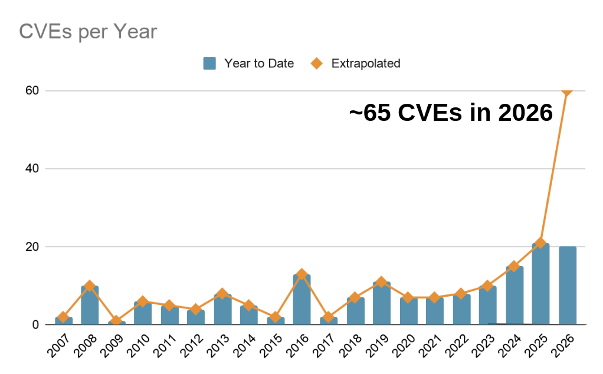
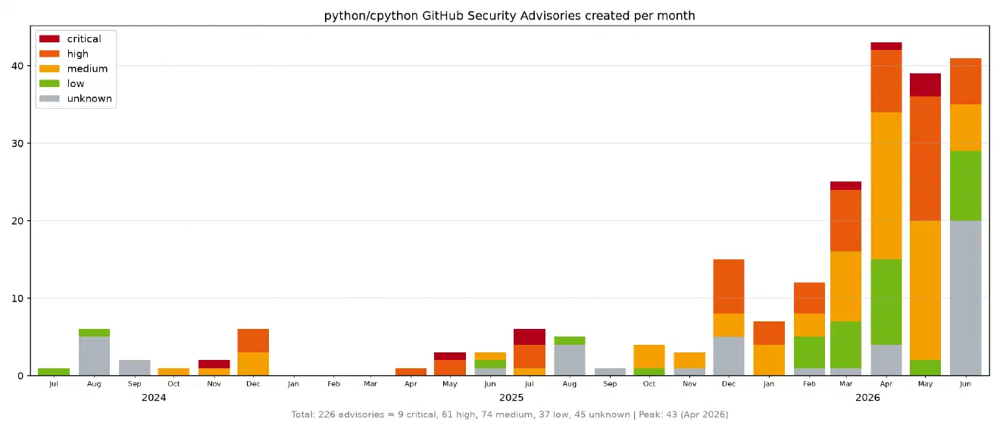

.. SPDX-FileCopyrightText: 2023 cusy GmbH
..
.. SPDX-License-Identifier: BSD-3-Clause

Sicherheit
==========

:term:`PyPI` hostet Stand Juli 2026 über eine dreiviertel Millionen Pakete, und
diese Zahl wächst täglich. Ein durchschnittliches Python-Projekt bezieht
Dutzende weiterer Abhängigkeiten ein – Pakete, die ihr nie explizit ausgewählt
habt, auf die ihr aber dennoch angewiesen seid, weil eure Abhängigkeiten sie
benötigen. Wenn ihr pandas in eurer Anwendung installiert, erhaltet ihr mehr
als nur pandas. Der vollständige Abhängigkeitsbaum sieht so aus:

.. code-block:: console

   $ uv add pandas
   $ uv pip tree
   myapp v0.1.0
   └── pandas v3.0.5
       ├── numpy v2.5.1
       └── python-dateutil v2.9.0.post0
           └── six v1.17.0

Obwohl ihr nur ein Paket (``pandas``) hinzufügen wolltet, habt ihr ungefragt
vier erhalten. Auch wenn eines dieser transitiven Pakete, die ihr nie explizit
installiert habt, eine Sicherheitslücke aufweisen sollte, ist eure gesamte
Anwendung gefährdet. Damit vergrößert sich die Angriffsfläche enorm im Vergleich
zu dem, was ihr selbst in ``dependencies`` angegeben habt.

Hier nur einige Angriffe der letzten Zeit auf die Software-Lieferkette:

LiteLLM/Telnyx
    Im März diesen Jahres wurden nach der Offenlegung eines API-Tokens aufgrund
    einer `ausgenutzten trivy-Abhängigkeit
    <https://www.aquasec.com/blog/trivy-supply-chain-attack-what-you-need-to-know/>`_
    Versionen der Pakete `litellm <https://pypi.org/project/litellm/>`_ und
    `telnyx <https://pypi.org/project/telnyx/>`_ auf :term:`PyPI`
    veröffentlicht, die Malware zum Ausspähen von Anmeldedaten enthielten. Die
    Malware wurde bei der Installation ausgeführt, sammelte sensible
    Anmeldedaten und Dateien und leitete diese an eine entfernte API weiter.

    .. seealso::
       `Incident Report: LiteLLM/Telnyx supply-chain attacks, with guidance
       <https://blog.pypi.org/posts/2026-04-02-incident-report-litellm-telnyx-supply-chain-attack/>`_

Phishing-Angriff per E-Mail auf PyPI-User
    Auch im April 2026 hält die Welle von Phishing-Angriffen, bei denen
    Domain-Verwechslungen ausgenutzt und seriös wirkende E-Mails versendet
    werden, weiterhin an. Es handelt sich um denselben Angriff, der bereits im
    Juni 2025 auftrat und auf viele andere Open-Source-Repositorys abzielt,
    allerdings mit einem anderen Domainnamen.

    .. seealso::
       `PyPI Users Email Phishing Attack
       <https://blog.pypi.org/posts/2025-07-28-pypi-phishing-attack/>`_

ZIP-Parser-Verwirrungsangriffe
    Im August 2025 führte :term:`PyPI` Restriktionen ein, die verhindern sollen,
    dass es bei Installations- und Prüfprogramme für Python-Pakete durch
    unterschiedliche Implementierungen des ZIP-Parsers zu Verwechslungen kommen
    kann. :term:`uv` zeigte ein anderes Entpackungsverhalten als viele
    Python-basierte Installationsprogramme, die :mod:`zipfile` verwenden.

    .. seealso::
       `uv security advisory: ZIP payload obfuscation
       <https://astral.sh/blog/uv-security-advisory-cve-2025-54368>`_

.. _token_exfiltration:

Token Exfiltration
    Im September 2025 wurde Code in GitHub-Actions-Workflows in über 570
    Repositories eingeschleust und dabei mehr als 3.300 Secrets, darunter
    :term:`PyPI`- npm-Token sowie AWS-Zugriffsschlüssel gestohlen. PyPI sperrte
    alle gestohlenen Token aus und forderte alle User auf, zu
    :ref:`trusted_publishers` zu wechseln.

    .. seealso::
       `Token Exfiltration Campaign via GitHub Actions Workflows
       <https://blog.pypi.org/posts/2025-09-16-github-actions-token-exfiltration/>`_

Ultralytics
    Im Dezember 2024 wurde `ultralytics
    <https://pypi.org/project/ultralytics/>`_ Opfer eines Supply-Chain-Angriffs,
    bei dem zunächst die GitHub-Actions-Workflows des Projekts und anschließend
    dessen PyPI-API-Token kompromittiert wurden. Zur Durchführung dieses
    Angriffs wurde keine Sicherheitslücke in :term:`PyPI` ausgenutzt.

    .. seealso::
       `Supply-chain attack analysis: Ultralytics
       <https://blog.pypi.org/posts/2024-12-11-ultralytics-attack-analysis/>`_

Shai-Hulud
    Im November 2025 entwickelt sich ein Angriff auf das `npm
    <https://www.npmjs.com/>`_-Ökosystem weiter und nutzt kompromittierte Konten
    aus, um schädliche Pakete zu veröffentlichen. Diese als *Shai-Hulud*
    bezeichnete Kampagne hat eine große Anzahl von JavaScript-Paketen ins Visier
    genommen und Zugangsdaten abgezogen, um sich weiter zu verbreiten.
    :term:`PyPI` selbst wurde zwar nicht ausgenutzt, jedoch wurden einige
    PyPI-Anmeldedaten in kompromittierten Repositoriess offengelegt.

    .. seealso::
       `PyPI and Shai-Hulud: Staying Secure Amid Emerging Threats
       <https://blog.pypi.org/posts/2025-11-26-pypi-and-shai-hulud/>`_

Das sind keine theoretischen Angriffe. Sie haben sich bei echten Projekten mit
Millionen von Nutzer*innen ereignet. Wenn ihr ein bösartiges Paket auf PyPI
entdeckt, könnt ihr es über das `Sicherheitsmeldesystem von PyPI
<https://pypi.org/security/>`_ melden.

Im Juni 2026 veröffentlichte Seth Larson, Mitglied des `Python Security Response
Team <https://devguide.python.org/security/psrt/>`_, eine Grafik zur jährlichen
Entwicklung der von Python veröffentlichten Sicherheitslücken, aus der eine
Verdreifachung im Jahr 2026 erwartet wird:

         wird  mit der Veröffentlichung von etwa 65 CVEs gerechnet.

   Quelle: https://mastodon.social/@sethmlarson/116680832573268456

Dies spiegelt jedoch lediglich die Ergebnisse wider und gibt keinen Überblick
über die eingehenden Meldungen. Viele davon werden geschlossen und stattdessen
als nicht sicherheitsrelevante Fehlermeldungen behandelt; andere werden weder
als Sicherheits- noch als Fehlermeldungen geschlossen. Hier ist die Anzahl der
seit Juli 2024 erstellten Berichte zu GitHub-Sicherheitshinweisen:

         null pro Monat, steigend auf etwa 40 im Jahr 2026.

   Quelle: Hugo van Kemenade: `Security: line goes up
   <https://hugovk.dev/blog/2026/security-line-goes-up/>`_

.. toctree::
    :hidden:
    :titlesonly:
    :maxdepth: 0

    dependencies
    environments
    sbom
